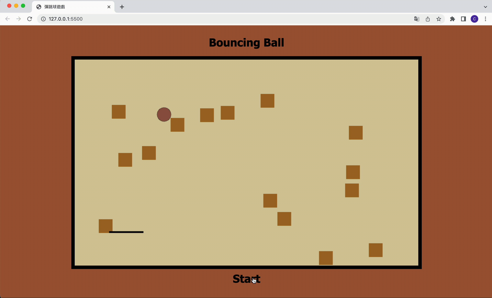

# Bouncing Ball 經典彈跳球遊戲 🔴🟠🟡🟢🟣⚫️⚪️🟤

動態畫面

靜態畫面

## 📌 專案目的

透過經典遊戲的復刻，著重在 JavaScript 的編程運用

## 🎯 專案功能

- 點擊“Start"按鈕可重新開始遊戲
- 根據滑鼠游標的移動，遊戲區中的橫條可隨其方向做橫向移動
- 球體隨機於遊戲區作移動，如有碰撞到遊戲區的邊界或橫條皆會反彈
- 球體如碰撞到遊戲區裡的方塊，方塊即會消失
- 當全部的方塊皆消失，遊戲即結束，畫面中即跳出通知

## ✔️ 開始使用

1. 將專案 clone 到本地
2. 在本地開啟之後，透過終端機進入資料夾
3. 打開瀏覽器，並輸入 http://127.0.0.1:5500/ 進入首頁

## 🎮 立即體驗

點按即進入遊戲：https://cching01099.github.io/BouncingBall/
